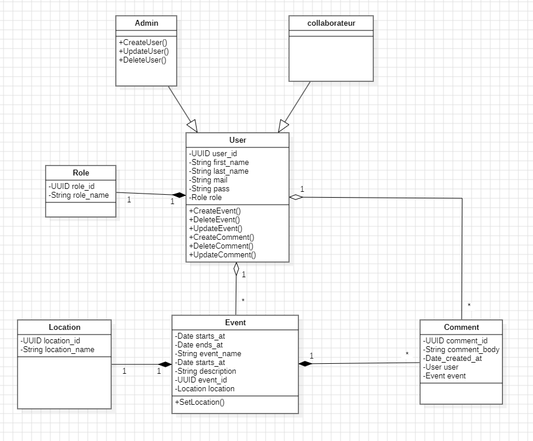
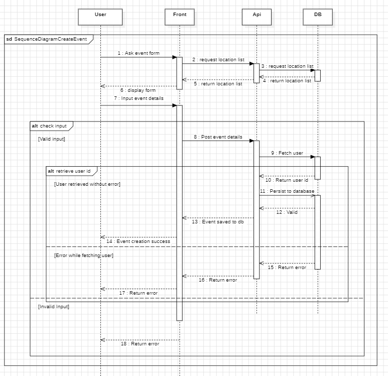

# corpo-event-steel-werewolfes
## Sommaire
- [Contexte du projet](#contexte-du-projet)
- [Modalités pédagogiques](#modalités-pédagogiques)
- [Modalités d'évaluation](#modalités-dévaluation)
- [Livrables](#livrables)
- [Critères de performance](#critères-de-performance)
- [Annexe : Tous les diagrammes](#annexe--tous-les-diagrammes)
  - [Use Case](#use-case)
  - [Classes](#classes)
  - [Séquences](#séquences)
  - [Activités](#activités)
  - [Merise](#merise)
- [Guide d'importation de la base de données](#guide-dimportation-de-la-base-de-données)
- [Guide de démarrage rapide](#guide-de-démarrage-rapide)

## Contexte du projet

Une entreprise souhaite faire partager des évènements qu'elle organise à l'ensemble de ses collaborateurs.
Le problème c'est que ses collaborateurs sont situés sur énormément de sites différents.
Et ceux-ci ne lisent pas forcément tous les mails qui leur sont adressés.

C'est pourquoi elle vous demande de réfléchir à la conception et de démarrer la réalisation d'une plate-forme permettant de partager sur des évènements futurs et aussi d'en proposer des nouveaux.

> **Optionnel** : il sera également possible pour les collaborateurs d'ajouter des commentaires sur les évènements

## Modalités pédagogiques

Activité en binôme

### Vous devrez réaliser les tâches suivantes :

- En analysant le besoin, vous devrez construire le diagramme de cas d'utilisation
- Vous devrez élaborer le diagramme de classes afin d'avoir une vision d'ensemble des classes à utiliser
- Vous devrez ensuite concevoir les intérations entre les différents classes en réfléchissant aux différents scénarios possibles via le diagramme de classes
- Vous devrez réaliser les développements en respectant les principes de la POO (SOLID, ...)

## Modalités d'évaluation

Evaluation entre pairs puis par les formateurs

## Livrables

Repo Git avec :
* dossier de conception contenant :
   * diagramme de cas d'utilisation
   * diagramme de classes
   * diagramme de séquences
* les sources

## Critères de performance

- Exhaustivité des fonctionnalités dans les diagrammes
- Quelques fonctionnalités développées dans le langage de votre choix
- Respect du principe SOLID
- Notions POO correctement appréhendées

## Annexe : Tous les diagrammes

### Use Case
<details>
<summary>Diagramme de cas d'utilisation</summary>


</details>

### Classes
<details>
<summary>Diagramme de classes</summary>


</details>

### Séquences
<details>
<summary>Diagrammes de séquence (cliquez pour développer)</summary>

#### Création d'un collaborateur


#### Création d'un événement


#### Gestion des commentaires


</details>

### Activités
<details>
<summary>Diagrammes d'activité (cliquez pour développer)</summary>

#### Création d'événement


#### Gestion des commentaires


#### Authentification


</details>

### Merise
<details>
<summary>Diagrammes Merise (cliquez pour développer)</summary>

#### Modèle Conceptuel de Données (MCD)


#### Modèle Logique de Données (MLD)


#### Modèle Physique de Données (MPD)

</details>

## Guide d'importation de la base de données

### Prérequis
- PostgreSQL installé sur votre machine
- Les droits d'administration sur PostgreSQL

### Étapes d'importation

1. Créez une nouvelle base de données :
```sql
CREATE DATABASE corpo_event;
```

2. Importez le script SQL :
```bash
psql -U postgres -d corpo_event -f doc/merise/corpo-event-db-script.sql
```

Ou si vous préférez utiliser pgAdmin :
1. Ouvrez pgAdmin
2. Créez une nouvelle base de données nommée "corpo_event"
3. Clic droit sur la base de données > Query Tool
4. Ouvrez le fichier `doc/merise/corpo-event-db-script.sql`
5. Exécutez le script

### Vérification
Pour vérifier que l'importation s'est bien passée, vous pouvez exécuter :
```sql
SELECT * FROM information_schema.tables 
WHERE table_schema = 'public';
```
Cette commande devrait afficher la liste de toutes les tables créées.

## Guide de démarrage rapide

### Prérequis
- Java JDK 17 ou supérieur
- Maven
- PostgreSQL (voir section "Guide d'importation de la base de données")
- Docker et Docker Compose (pour l'environnement conteneurisé)

### Démarrage avec Docker

La façon la plus simple de démarrer l'application est d'utiliser Docker :

```bash
# Construire et démarrer les conteneurs
docker-compose up --build -d

# Voir les logs
docker-compose logs -f

# Arrêter les conteneurs
docker-compose down

# Supprimer les volumes (reset complet)
docker-compose down -v
```

L'application sera disponible sur :
- Frontend : http://localhost:8080
- Base de données : localhost:5432
  - Base de données : corpo_event
  - Utilisateur : postgres
  - Mot de passe : postgres

### Démarrage sans Docker

Si vous préférez démarrer l'application sans Docker :

1. Clonez le repository :
```bash
git clone https://github.com/votre-username/corpo-event-steel-werewolfes.git
cd corpo-event-steel-werewolfes
```

2. Configurez la base de données :
   - Suivez d'abord les étapes du "Guide d'importation de la base de données" ci-dessus
   - Vérifiez que les paramètres de connexion dans `src/corpo-event/src/main/resources/application.properties` correspondent à votre configuration PostgreSQL

3. Compilez et lancez l'application avec Maven :
```bash
./mvnw spring-boot:run
```
Ou sur Windows :
```bash
mvnw.cmd spring-boot:run
```

4. Accédez à l'application :
   - Ouvrez votre navigateur
   - Allez sur http://localhost:8080

### Utilisation
1. Page de connexion : http://localhost:8080/login
2. Pour créer un nouvel événement : http://localhost:8080/newEvent
3. Pour voir les événements : http://localhost:8080/home

### Comptes de test
- Admin :
    - login : admin@example.com
    - pass : admin

